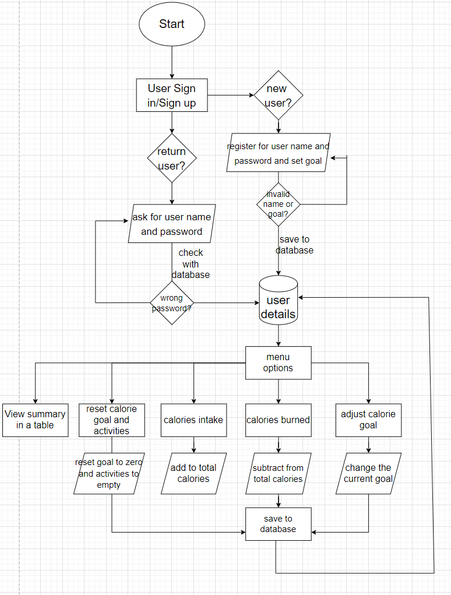

# T1A3 Ruby Terminal App - Daily Calorie Tracker
## Source Control Repo: [Github Repo](https://github.com/Jimmyboei/Ruby-Terminal-Application)
## Code Style Guide
The code follows the Ruby RuboCop style checker and is written in the VS Code. [ruby-rubocop](https://marketplace.visualstudio.com/items?itemName=misogi.ruby-rubocop)
## Implementation Plan
I developed a trello plan with cards and checklists and it can be found here: [trello plan](https://trello.com/b/LqANsIwd/t1a3)
## About The App
This app was designed to provide an easy way for people to track their daily calorie intakes and maintain a healthy life. It allows different users to create their daily calorie plans and record activities to stay on the right track. My inspiration to develop this app is from my weigh loss experience. This simple app has following features:

- user log in / sign up - each user can create individual daily goal and save changes
  
- add calorie intake - users can record food name and calories which will add to daily intake
- add workout - users can record their workouts and calorie consumption which will reduce the daily intake
- view activities - it provides a clear table summary of the user's input of both food intake and workout consomption
- reset progress - it allows users to reset their current progress and clear all activities
- change goal - it allows users to change their dail goal

## Control Flow

- The app starts by verifying the user. It displays a welcome message and asks the user to enter his/her name.
  
- User data is stored in a json file with each user's details saved as a hash. The app read all user data from the json file and pull user names into an array.
- User input is checked against the name array, if it matches the app will process to password check. If there're no matches it will ask user to sign up.
- For the password check, if it's wrong the app will go back to ask the user to enter correct password. For new user sign up, the name cannot be empty or an existing name, the goal should be set to value greater than zero. Once sign up is validated, new user details will be write back to the json file.
- After user verification, there is a welcome message that displays user's goal and current progress. Then the user can browse the menu and choose an option.
- The menu itself and food intake and workout have their own loop. This is to ensure that users can keep using different features until they decide to exit the app.
- Everytime users add an intake or workout or change the goal, these changes will be updated with messages to tell users of their new progress/goals. So they can have better track of their calorie activities.
- Once the user finish using the app, all changes will be write back to json file then the app exits with "thank you" message.

## Help Documentation
### Requirements
This app requires Ruby with latest version of 3.1.1
This [link](https://www.ruby-lang.org/en/downloads/) provides guides on how to set up environment and install Ruby. 
### Dependencies
Following Ruby Gems are used in this app:
- rspec (~> 3.11) - for test and debug methods
- tty-prompt (~> 0.23.1) - for better interaction and validation with user inputs, also used for menu navigation
- tty-table (~> 0.12.0) - for table generation and better display with ascii
### Installation
- Download the app from the [github repo](https://github.com/Jimmyboei/Ruby-Terminal-Application) and unzip to an individual folder.
   
- In the terminal, change directory to the app's folder then type the command `run_app.sh` to execute the app.
- If the app fails to start, you can still run it by using following instruction:
  1. In the terminal, type `gem install bundler` , you can skip this step if you installed it before
   
  2. Then type `bundle install` and it will install all required gems for the app
  3. type `ruby main.rb` and the Calorie Tracker will show up. Have fun and enjoy a healthy lifestyle!
- To view the help information, simply type `ruby main.rb --h` or `ruby main.rb --help`
